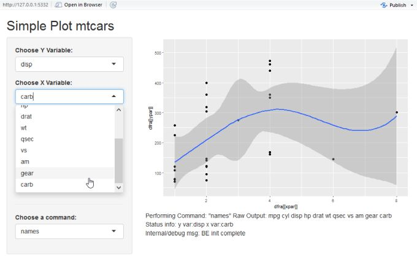

```{r setup, include=FALSE}
knitr::opts_chunk$set(echo = TRUE)
```

## Application Overview

An application whose main goal is to learn and practise Shiny basic features useful in real applications, even if not taught in the course (ex. logging a diagnostic message to Web GUI, automatically updating an internal status diagnostic on the Web GUI).  

The types of application functionalities are two:  

**Run some statistic functions** (names, ncol, mean ...)  
  - on the whole mtcars dataframe <b>or</b>  
  - on the selected "x" variable  
  Commands output is shown as raw text  

**Display a scatterplot** of mtcars data set, for any couple of **variables chosen by the user**.  
For this shiny GUI elements are used  
- to select which are the two variables to plot (the y, the x)  
- to control details of the plot (smooth type, if any; point size)  


## Functionality: mtcars Scatterplot
From a listbox the user chooses which variable of mtcars will have the role of "y"


In the same way in the listbox below the user chooses which variable will have the role of "x"




## Running Statistic Functions  

The user can run basic functionalities choosing them from a listbox, they are divided in two groups:  
- commands on the whole dataframe  
- commands on a single variable (the current "x" variable)  


The output of these functions is shown in raw text on the bottom right, below the plots, where there are 3 types of text:  
- these functions output  
- internan diagnostic info about the state of the application (currently which are the x and y vars)  
- the last debug message ouput by programmer's code  


## Some internal details  

### Code Structure
The application is structured in 3 files  
-  The standard server.R and ui.R prescribed by shiny  
- <b>backend.R</b>  

backend.R decouples the (minimal) business logic from the GUI; it contains all and only non-GUI code.  
This basic good practise, in a real application, would allow to test the business logic on its own, independently from the GUI


### reactiveValues()  

The debug messages printed to the web GUI and the automatic updating of the internal status message, was implemented using [reactiveValues()] (https://shiny.rstudio.com/reference/shiny/latest/reactiveValues.html) that gives to "normal" values properties similar to those of the GUI widgets, ie automatic update of the GUI (via the server) when a value is changed by the programmer's code (rather than by a GUI widget).


```{r sampleCodeReactive, eval=FALSE}

# creating the "reactive" variable (a list used similarly to)
# server.R's anonoymous function's input and output
values <<- reactiveValues()

# in server.R anonymous function
output$traceOut <- renderText({
  paste("Internal/debug msg:",values$msg)
})

```


### Basic Classes/Objects in R  

To keep together the plot options (managed by GUI widgets) a simple class was created, 
```{r sampleCode, cache = FALSE, echo = TRUE, message = FALSE, warning = FALSE, tidy = FALSE}
setClass("plotParsClass",
  slots = c(regrSmoot = "character", pointSize = "numeric"))
plotPars = new("plotParsClass")
plotPars@pointSize <- 4 # in real app would get value from
# input$pointSize  in turn from sliderInput("pointSize", ...)
cat(plotPars@pointSize)
```

